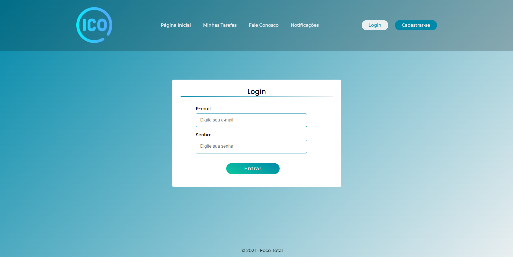
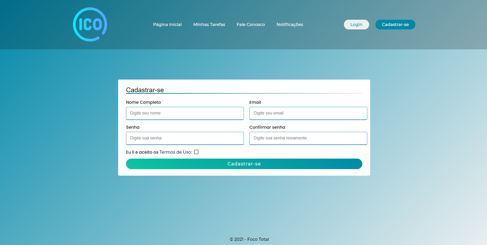
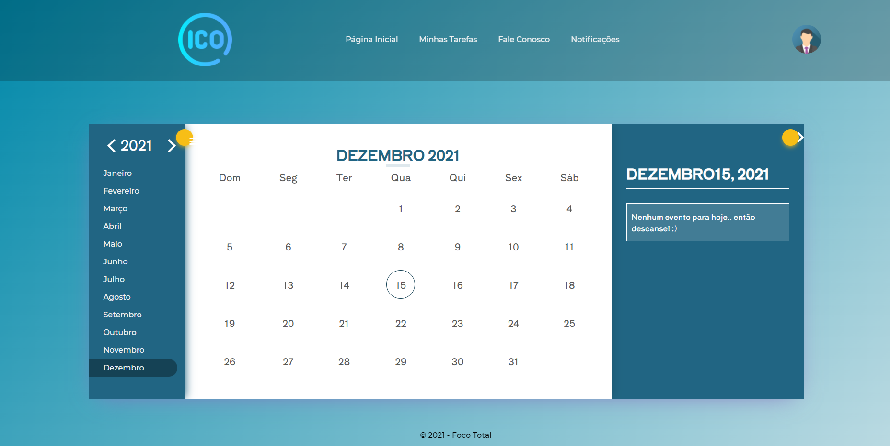
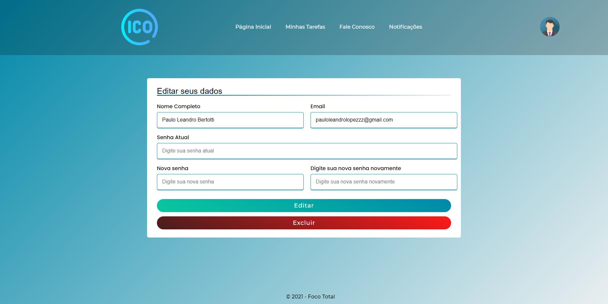
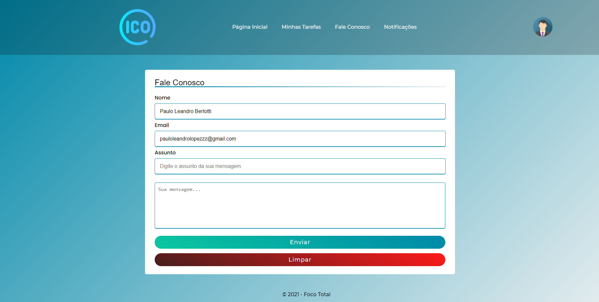

<h1 align="center">
   Foco Total
</h1>

 

## :camera: Demonstração

## :rocket: Tecnologias

Esse projeto foi desenvolvido com as seguintes tecnologias:

✔️HTML5

✔️CSS3

✔️Javascript

✔️jQuery

✔️Bootstrap

✔️NodeJS + Express

✔️Redis

✔️MySQL

## 💻 Projeto

A pandemia fez com que um grande número de pessoas mudassem seus hábitos e passassem a trabalhar e estudar em casa, o que causou uma série de desafios para todos, principalmente quando se trata de focar em uma tarefa. O Foco Total foi criado com o objetivo de auxiliar esses indivíduos.

## ⚙ Configuração

Atenção! É necessário que você tenha o Redis e o banco MySQL instalado para poder utilizar a Aplicação!

1- Para instalar as dependências:
> npm i

2- Para iniciar a aplicação:
> node projeto/server.js
